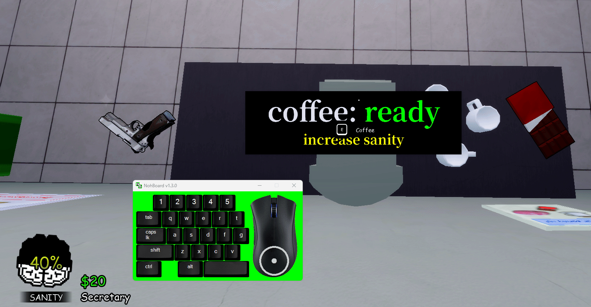

# sageSanity

auto sanity manager for **animal hospital** on roblox. automatically drinks coffee based on the selected machine cooldown so you never lose your sanity while sleepin

---

## requirements

- windows 10 or 11
- [autohotkey v2](https://www.autohotkey.com) , make sure you download **v2**, not v1.1

---

## features

- automatic coffee drinking while afk
- gui control panel
- configurable settings
- multiple coffee machine support
- cooldown countdown display

---

## installation

1. install autohotkey v2 from [autohotkey.com](https://www.autohotkey.com)
2. download the latest release from the releases page
3. make sure `config.ini` is in the same folder as `sageSanity.ahk`
4. right-click `sageSanity.ahk` → **run script**

---

## usage

| key | action |
|-----|--------|
| `F1` | toggle macro on/off |

- press **F1** to start, the macro will drink coffee immediately, then every selected machine cooldown automatically
- a countdown tooltip shows how long until the next drink
- press **F1** again to stop at any time
- you can also use the gui **start** and **stop** buttons

---

## gui

the gui allows you to:

- start and stop the macro
- select your coffee machine
- manage settings without editing the script

---

## configuration

settings can be customized through `config.ini`

example:

```ini
[Settings]
Machine=Main
Cooldown=180000
HoldDuration=2000
Clicks=3
ClickGap=1500
````

---

## how it works

when toggled on, sageSanity holds **E** for 2 seconds (interact with coffee machine), then clicks 3 times to drink. it waits for the selected machine cooldown to expire, then repeats forever.



---

## notes

* make sure you're on top of the coffee machine when you start the macro, or reposition yourself before each drink cycle
* the macro does not move your character, you need to already be in range of the machine
* works while the game window is in the background as long as roblox is running

---

## known limitations

- the macro does not detect player position
- you must already be within range of the coffee machine
- the macro cannot tell if another ui is blocking interaction

---

## credits

built by **sage,** inspired by [dolphSol-Macro](https://github.com/BuilderDolphin/dolphSol-Macro) by BuilderDolphin

sweet dreams :3
